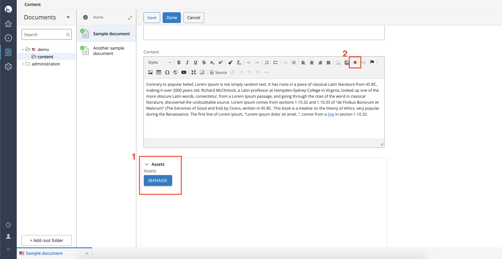
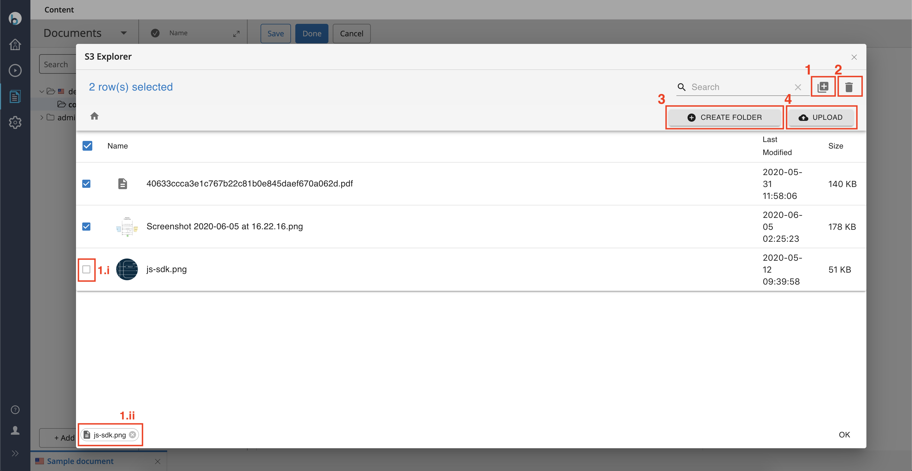
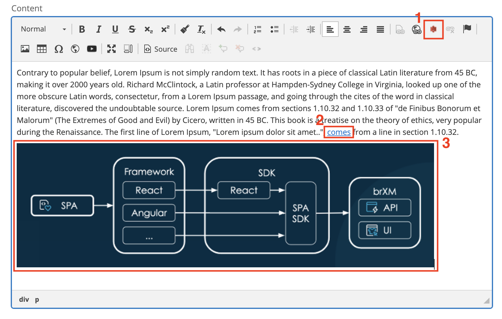

## Installation

- In the root pom.xml configure in the properties a version for the plugin, make sure to include the required repository in the repositories section and add the bellow dependency both in the dependencyManagement and dependencies section
```xml
    <properties>
        <brxm.s3.manager.version>x.y.z</brxm.s3.manager.version>
    </properties>

    <repositories>
      <!-- SNIP -->
      <repository>
        <id>hippo-maven2-forge</id>
        <name>Hippo Maven 2 Repository</name>
        <url>https://maven.onehippo.com/maven2-forge/</url>
      </repository>
      <!-- SNIP -->
    </repositories>

    <dependencyManagement>
        <dependencies>
          <!--SNIP-->
          
          <dependency>
            <groupId>com.bloomreach.xm.manager</groupId>
            <artifactId>brxm-s3-manager-common</artifactId>
            <version>${brxm.s3.manager.version}</version>
            <scope>provided</scope>
          </dependency>
          
          <!--SNIP-->
        </dependencies>
    </dependencyManagement>
    
    <dependencies>
        <!--SNIP-->
    
        <dependency>
          <groupId>com.bloomreach.xm.manager</groupId>
          <artifactId>brxm-s3-manager-common</artifactId>
          <version>${brxm.s3.manager.version}</version>
          <scope>provided</scope>
        </dependency>
    
        <!--SNIP-->
    </dependencies>
```

- In the root pom.xml under the profile cargo run and in the 
```xml
    <build>
        <plugins>
            <plugin>
                <groupId>org.codehaus.cargo</groupId>
                <artifactId>cargo-maven2-plugin</artifactId>
                <!--SNIP-->
                <configuration>
                    <container>
                        <!--SNIP-->
                        <dependencies>
                          <!--SNIP-->
                    
                          <dependency>
                            <groupId>com.bloomreach.xm.manager</groupId>
                            <artifactId>brxm-s3-manager-common</artifactId>
                            <classpath>shared</classpath>
                          </dependency>
                    
                          <!--SNIP-->
                        </dependencies>
                    </container>
                </configuration
            </plugin>
        </plugins>
    </build
```

- In the `src/main/assembly/shared-lib-component.xml` add the below entry
```xml
  <include>com.bloomreach.xm.manager:brxm-s3-manager-common</include>
```

- Add the below dependencies in the `cms-dependencies/pom.xml`

```xml
    <dependency>
      <groupId>com.bloomreach.xm.manager</groupId>
      <artifactId>brxm-s3-manager-common</artifactId>
    </dependency>
    <dependency>
      <groupId>com.bloomreach.xm.manager</groupId>
      <artifactId>brxm-s3-manager-api</artifactId>
      <version>${brxm.s3.manager.version}</version>
    </dependency>
    <dependency>
      <groupId>com.bloomreach.xm.manager</groupId>
      <artifactId>brxm-s3-manager-repository</artifactId>
      <version>${brxm.s3.manager.version}</version>
    </dependency>
    <dependency>
      <groupId>com.bloomreach.xm.manager</groupId>
      <artifactId>brxm-s3-manager-frontend-app</artifactId>
      <version>${brxm.s3.manager.version}</version>
    </dependency>
```
- Add the below dependencies in the `site/components/pom.xml`
```xml
    <dependency>
      <groupId>com.bloomreach.xm.manager</groupId>
      <artifactId>brxm-s3-manager-common</artifactId>
    </dependency>
    <dependency>
      <groupId>com.bloomreach.xm.manager</groupId>
      <artifactId>brxm-s3-manager-site</artifactId>
      <version>${brxm.s3.manager.version}</version>
    </dependency>
```

- In the `site/webapp/src/main/webapp/WEB-INF/web.xml` add to the hst-beans-annotated-classes parameter (comma separated value) the value below
```xml
  classpath*:com/bloomreach/xm/manager/**/*.class
```

- In the content bean of the document type that you have enabled the S3 compound add a getter similar to this
```java
@HippoEssentialsGenerated(internalName = "demo:assets", allowModifications = false)
    public S3managerpicker getAssets() {
        return getBean("demo:assets", S3managerpicker.class);
    }
```
---
### Daemon module configuration

The configuration of the S3 manager daemon module can be accessed and modified from the Console under `/hippo:configuration/hippo:modules/s3manager`

---
> **Note :** The daemon module can be reconfigured while the application is running.The changes will be picked up without the need to restart it. **However, all uploads in progress will be aborted.** 
---

| property | type| default value | required| description | notes |
|--|--|--|--|--|--|
|accessKey | string | none | yes | your S3 access key |Optionally, if required this property can be passed as an environment variable or system property with the name `XM_S3_ACCESS_KEY`. In this case the module configuration property is not required. The order we check the configuration is environment, system and module.|
|secretKey | string | none | yes | your S3 secret key |Optionally, if required this property can be passed as an environment variable or system property with the name `XM_S3_SECRET_KEY`. In this case the module configuration property is not required. The order we check the configuration is environment, system and module.|
|region | string | none | yes | the appropriate AWS region for your account. For a full list of the available regions please visit this [page](https://docs.aws.amazon.com/general/latest/gr/s3.html) | |
|bucket | string | none | yes | your S3 bucket name | |
|presigned | boolean | false | yes |flag to generate either static or presigned URLs during rendering | |
|expirationTime | long | none | no | used with presigned true and value is expiration in minutes | |
|allowedExtensions | multi string | null | no | optionally define the list of allowed mime types or extensions for the upload operation `Eg.: image/*, application/pdf, .psd` | |
|maxFileSize | long | 160000 | no | the maximum allowed file size in MB. | |
|chunkSize | long | 5 | no | the size of chunks in MB for a multi part upload. | |
|timeout | long | 0 | no | the time a call will timeout in milliseconds. 0 is the value for no timeout. | |
---
### User Roles

The plugin provides 4 different user roles.

| role | description |
|--|--|
|xm.s3manager.user|General role that gives the right to utilise the plugin and make selections. |
|xm.s3manager-create.user| Role that grants the create folder right. |
|xm.s3manager-upload.user| Role that grants the upload files to S3 right. |
|xm.s3manager-delete.user| Role that grants delete rights on any folder/asset. |
--- 
### (Optional) Add CKEditor S3 Manager button

If you are editing directly a yaml file, configure the below property on the /cluster.options: node of an RTF field in a document type of your project or on global level `/hippo:namespaces/system/Html/editor:templates/_default_`
```yaml
ckeditor.config.overlayed.json: '{   extraPlugins: ''iframedialog,s3manager''                 }'
```
If configuring the document via Console or CMS document editor
```yaml
ckeditor.config.overlayed.json: {   extraPlugins: 'iframedialog,s3manager'                 }
```

- Add custom content rewriter for RTF

    In your project add the below line in `site/webapp/src/main/webapp/WEB-INF/hst-config.properties`
```properties
    default.hst.contentrewriter.class = com.bloomreach.xm.manager.rewriter.S3AssetsLinkRewriter
```

---

### S3 Manager End User documentation

#### Overview

1. S3 asset manager as compound on document level.
1. S3 asset manager as ckeditor plugin for RTF field.

#### Compound OpenUI field

1. Add selected assets collection to documents field.
    1. Selected assets after addition become disabled to avoid duplicate selection.
    1. Manage currently selected assets.
1. Delete selected assets directly from your S3.
1. Create a new folder in your S3 in the current directory.
1. Upload new assets directly to your S3 in the current directory from your local storage.

#### ckeditor plugin

> Note : ckeditor though uses the same UI operates as a **single select**.

The plugin supports two possible operations
* anchor tag generation with `href` to S3 asset
* img tag generation with `src` to S3 asset


1. S3 plugin icon
1. Selected text that was transformed to an anchor with `href` to an S3 asset.
1. Image tag that was generated with `src` from an S3 image asset.

Anchor generation
1. Select the desired text from the RTF field and click on the S3 icon.
1. Select an asset, add it to the collection and click OK.

Image generation
1. Without selecting any text click on the S3 icon.
1. Select an image asset, add it to the collection and click OK.

## Release Notes

| CMS Version| XM S3 Manager Version| Release Notes
|--|--|--|
| 15.x.x | 1.0.0 | Upgrade to BrXM version 15.x |